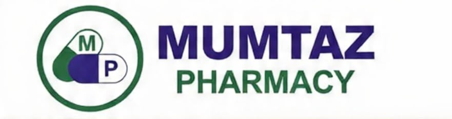

# Mumtaz Pharmacy — HR & Payroll Management System
## Active Implementation Plan (18 Features) + Standalone Biometric Plan



---

## 1. Executive Summary

Per project direction:
1. **Fingerprint Verification** has been moved to a separate standalone plan: [`docs/BIOMETRIC_INTEGRATION_PLAN.md`](BIOMETRIC_INTEGRATION_PLAN.md) so your friend/teammate can work on it independently.
2. The **Active System** implements the remaining **18 Core Features** divided into **6 clear Sub-Plans**, featuring counter Check-in / Check-out, status determination, 2-leave and 4-half-day quota tracking, salary advance/medicine credit khata, 1-click payroll calculation, and management reports.
3. The 11 out-of-budget features (Geofencing, Automated 3-Late Penalties, Overtime calculation, Task board, etc.) remain strictly excluded.

---

## 2. Active 6 Sub-Plans

```
┌─────────────────────────────────────────────────────────────────────────────┐
│                 MUMTAZ PHARMACY HR & PAYROLL ACTIVE SYSTEM                  │
├──────────────────────┬──────────────────────┬───────────────────────────────┤
│ SUB-PLAN 1           │ SUB-PLAN 2           │ SUB-PLAN 3                    │
│ Staff Profiling &    │ Attendance Engine &  │ Leave & Half-Day              │
│ Management           │ Check-in / Check-out │ Quota Engine                  │
│ (Feat 1, 2, 19)      │ (Feat 4, 5, 6, 18)   │ (Feat 7, 8, 9, 10)            │
├──────────────────────┼──────────────────────┼───────────────────────────────┤
│ SUB-PLAN 4           │ SUB-PLAN 5           │ SUB-PLAN 6                    │
│ Advance & Medicine   │ 1-Click Unified      │ Admin Dashboard               │
│ Credit Khata         │ Payroll Engine       │ & Reports                     │
│ (Feat 11, 12, 13)    │ (Feat 14, 15)        │ (Feat 16, 17)                 │
└──────────────────────┴──────────────────────┴───────────────────────────────┘
```

### 📋 Sub-Plan 1: Staff Profiling & Directory Management (Feat 1, 2, 19)
- **Feature 1**: Staff Profiling (Name, Phone, CNIC, Address, Designation, Monthly Salary, Joining Date)
- **Feature 2**: Staff CRUD & Live Search (Add, Edit, Delete/Deactivate, Live Search)
- **Feature 19**: Complete Staff History (Full employee dossier with personal details, attendance logs, leave records, and khata ledger)

### 🕒 Sub-Plan 2: Core Attendance & Check-in / Check-out (Feat 4, 5, 6, 18)
- **Feature 4**: Check-in / Check-out (Arrival Time-IN & Departure Time-OUT with total hours worked)
- **Feature 5**: Duty Status (`Present`, `Absent`, `Late`, `Half-Day`)
- **Feature 6**: Daily Live Roster & Monthly Attendance Grid
- **Feature 18**: Manual Admin Editing (Admin override to rectify punch times or status)

### 🌴 Sub-Plan 3: Leave & Half-Day Quotas Engine (Feat 7, 8, 9, 10)
- **Feature 7**: 2 Paid Leaves per Month Quota
- **Feature 8**: Extra Leave Tracking & Loss of Pay Deduction (`(Leaves - 2) * Daily Wage`)
- **Feature 9**: 4 Half-Days per Month Allowance
- **Feature 10**: Extra Half-Day Salary Deduction (`(Half-Days - 4) * 0.5 * Daily Wage`)

### 💳 Sub-Plan 4: Staff Advance & Medicine Credit Khata (Feat 11, 12, 13)
- **Feature 11**: Salary Advance & Medicine Credit Entry (Cash drawer advances + store medicine credits)
- **Feature 12**: Advance / Ledger History (Full audit trail and settlement tracking)
- **Feature 13**: Automatic Advance Deduction from Salary (Auto-settlement upon payroll calculation)

### ⚡ Sub-Plan 5: 1-Click Monthly Salary Calculation (Feat 14, 15)
- **Feature 14**: One-Click Monthly Salary Calculation for all active staff
- **Feature 15**: Unified Salary Calculation Formula:
  $$\text{Daily Wage} = \frac{\text{Monthly Salary}}{\text{Days in Month}}$$
  $$\text{Net Salary} = \text{Basic} - \text{Absent Cuts} - \text{Extra Leave Cuts} - \text{Extra Half-Day Cuts} - \text{Advance Deductions}$$
  *(Strictly zero automated 3-late penalty cuts; zero overtime additions)*.
- Printable Official Mumtaz Pharmacy Biometric Salary Payslips

### 📊 Sub-Plan 6: Admin Dashboard & Reports (Feat 16, 17)
- **Feature 16**: Admin Dashboard (Real-time store metrics, today's roster, monthly liability, recent khata)
- **Feature 17**: Attendance, Salary, Leave & Advance printable management reports
